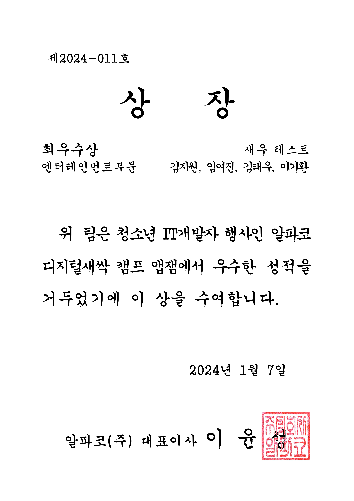
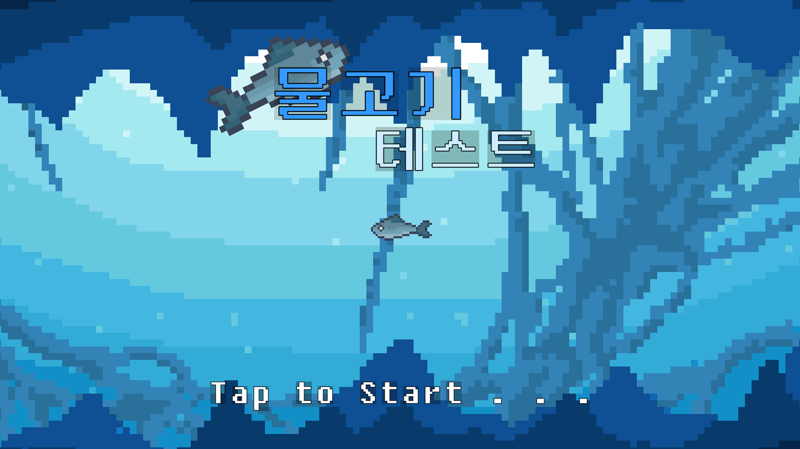
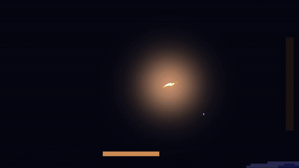

# 🫙 2024년 제 24회 앱잼

  

# 🦋 TEAM. 나비효과
**[김지원(팀장/기획)](https://github.com/jscom-common) / [이기환(메인개발)](https://github.com/LeeKiHwan) / [임여진(개발)](https://github.com/ye0jin) / [김태우(개발)](https://github.com/taeng0720)**

앱잼은 알파코 디지털새싹 캠프, SK플래닛이 공동으로 주최하는 고등학생 앱 및 융합 서비스 개발 경진대회입니다.

2024년 1월 6일 부터 1월 7일 까지 2D 퍼즐 스토리 게임 새우 테스트를 개발하여 최우수상을 수상했습니다.

🏆 **앱잼 최우수상 상장**

 　　　 

  

# 🦐새우 테스트

**상처 주지 말고, 상처 받지 말고. 서로에게 이로운 존재가 되자!**

**새우 테스트 메뉴화면**

### 게임 제목 : 새우 테스트

**[Instagram](https://www.instagram.com/p/C2ejw6gpo7Z/?igsh=MWVvZnJpeTB4Z25veQ==) / [발표 자료](https://drive.google.com/file/d/1hdbg8M9qLed5-zqKN5IOU2tZUc8u0sY1/view)**

>  
>
>**개요 : 고래의 뱃속, 새우의 시점에서 진행하는 2D 퍼즐 스토리 게임**
>
> **개발 기간 : 2024/01/06 ~ 2024/01/07**
> 
> **사용 기술 : `Unity` `C#` `Universal RP`**
>
> **장르 : 2D 퍼즐 스토리 게임**
>
> **플랫폼 : PC**
>
> **스토리**
> - 어느날 고래에게 잡아먹혀버린 새우! 새우는 고래의 몸속으로 들어가게 된다. 그리고 새우는 고래의 몸속에 해양 오염으로 인한 플라스틱, 유리 쓰레기 등이 곳곳에 박혀있는걸 보게된다. 불쌍한 고래를 도와 쓰레기를 제거해주고, 고래의 몸속에서 탈출하자!
>
> **기획 의도**
> - 새우 테스트는 고래에게 잡아먹힌 새우 시점으로 게임을 플레이하게 됩니다. 플레이어는 새우를 조종하면서 고래를 도와주거나, 고래를 더욱 아프게 할 수 도있습니다. 또한 이러한 플레이어의 선택에 따라 엔딩이 달라집니다.
> - 저희 나비효과 팀은 이러한 요소들을 새우 테스트라는 게임에 녹여내어 플레이하는 유저로 하여금 상생에 대해 다시한번 고민하게 만들고, “상생을 지향하며 서로에게 이로운 존재가 되자!” 라는 메시지를 플레이어에게 전달하기 위해 새우 테스트를 제작하게 되었습니다.
>
>  

  

# 🎮 시연 영상

**https://youtu.be/JdqHYG2Hjo4**

  

# 🌌 프로젝트 기능 소개

## 플레이어

- 플레이어는 W,A,S,D키를 사용하여 움직일 수 있습니다. 또한 스페이스바를 통해 대쉬를 하여 빠르게 움직일 수 있습니다.
- 대쉬를 통해 고래의 몸속에 박혀있는 쓰레기들과 상호작용할 수 있습니다. 또한 좌클릭을 통해 획득한 유리 조각을 던질 수 있습니다.

### 플레이어 이동 및 대쉬

 

## 쓰레기

### **플라스틱 쓰레기**

- 플라스틱 쓰레기는 고래의 몸속에서 자주 볼 수 있는 쓰레기 입니다.
- 플레이어가 플라스틱 쓰레기 옆에서 대쉬를 하여 플라스틱 쓰레기와 부딪힐 경우 플라스틱 쓰레기를 고래의 몸속에서 뺄 수 있습니다.
- 반대로 플레이어가 플라스틱 쓰레기가 박혀있는 방향으로 대쉬를 하여 플라스틱 쓰레기와 부딪힐 경우 플라스틱 쓰레기가 고래의 몸속에 더욱 깊숙히 박히게 됩니다.
- 한번 빼거나, 박은 플라스틱 쓰레기는 더 이상 상호작용할 수 없습니다.

### **유리 쓰레기**

- 유리 쓰레기는 유리 조각을 얻을 수 있는 쓰레기 입니다.
- 플레이어가 대쉬를 하여 유리 쓰레기와 부딪힐 경우 유리 쓰레기가 깨져 유리 조각이 됩니다.
- 플레이어는 유리 조각을 주워 기생충을 처치할 수 있습니다.

### 플라스틱, 유리 쓰레기

 

## 기생충

- 기생충은 고래의 몸속을 돌아다니는 방해 몬스터입니다.
- 플레이어는 기생충과 닿게 되면 게임 오버를 하게 됩니다.
- 기생충은 유리 조각을 맞추어 처치할 수 있습니다.

### 기생충 충돌 시 게임 오버

 

## 고래 고통 게이지

- 플레이어의 화면 오른쪽에는 고래의 고통 게이지를 확일할 수 있습니다.
- 플레이어가 플라스틱 쓰레기를 빼주거나, 기생충을 처지해주면 고통 게이지가 줄어듭니다.
- 반대로 플레이어가 플라스틱을 몸속에 박게되면 고통 게이지가 늘어납니다.
- 플레이어는 마지막 스테이지를 클리어하였을 때 고통 게이지에 따라 다른 엔딩을 볼 수 있습니다.

 

## 엔딩

### **해피엔딩**

- 고래의 고통 게이지가 20% 미만이라면 스테이지를 클리어하였을 때 해피엔딩을 볼 수 있습니다.
- 해피엔딩에서는 고래가 새우에게 고마움을 느껴 등에서 물줄기를 뿜어 새우를 탈출시켜줍니다.

### **배드엔딩**

- 고래의 고통 게이지가 20% 이상이라면 스테이지를 클리어하였을 때 배드엔딩을 볼 수 있습니다.
- 배드엔딩에서는 고래가 새우에게 분노를 느껴 그대로 소화해버려 똥으로 배출시켜버립니다.

### 해피엔딩, 배드엔딩

